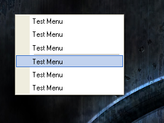



## Win XP Style Menu

### Description

Pretty much this is an Win XP style menu that Fades in and out alos includes the Drop Shadow Effect. It still could have alot more work done on it. I made this because the "Plane" style menus just wasnt cutting it, and I would like my menu to semi match the rest of my programs. Hope this helps. Please vote
 
### More Info
 
Smiles, Maybe money Haha

             |
---                |---
**Submitted On**   |2004-03-30 17:06:20
**By**             |[David Carrigan](https://github.com/Planet-Source-Code/PSCIndex/blob/master/ByAuthor/david-carrigan.md)
**Level**          |Intermediate
**User Rating**    |5.0 (15 globes from 3 users)
**Compatibility**  |VB 6\.0
**Category**       |[Custom Controls/ Forms/  Menus](https://github.com/Planet-Source-Code/PSCIndex/blob/master/ByCategory/custom-controls-forms-menus__1-4.md)
**World**          |[Visual Basic](https://github.com/Planet-Source-Code/PSCIndex/blob/master/ByWorld/visual-basic.md)
**Archive File**   |[Win\_XP\_Sty186003322005\.zip](https://github.com/Planet-Source-Code/david-carrigan-win-xp-style-menu__1-59261/archive/master.zip)

